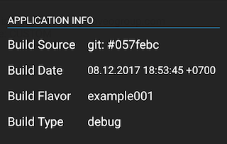
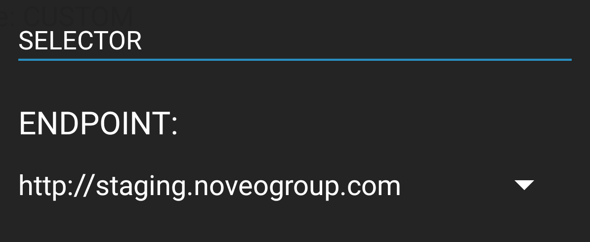
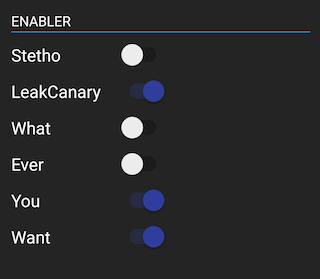

# Noveo Debug Drawer
 [  ](https://bintray.com/noveo-nsk/maven/debugdrawer-base/_latestVersion)
 
Based on [Android Debug Drawer](https://github.com/palaima/DebugDrawer) with ideas from [Jake Wharton's u2020](https://github.com/JakeWharton/u2020).

## What's new

1. GradleModule to make your QA happy.
2. EnablerModule & SelectorModule to replace build flavors in single apk.

## How to add

```groovy
//Extension: Build Info Module
implementation        'com.noveogroup:debugdrawer-buildinfo:0.0.4'

//Extension: Build Config Module (implicit dependency on debugdrawer-buildconfig-base)
debugImplementation   'com.noveogroup:debugdrawer-buildconfig:0.0.4'
releaseImplementation 'com.noveogroup:debugdrawer-buildconfig-no-op:0.0.4'

//Debug Drawer https://github.com/palaima/DebugDrawer
debugImplementation   'io.palaima.debugdrawer:debugdrawer:0.7.0'
releaseImplementation 'io.palaima.debugdrawer:debugdrawer-no-op:0.7.0'
debugImplementation   'io.palaima.debugdrawer:debugdrawer-view:0.7.0'
releaseImplementation 'io.palaima.debugdrawer:debugdrawer-view-no-op:0.7.0'
```

## Build Info Module

| `BuildInfoModule` |  
| :---: | 
|  | 
| Extracts build source information. Great for CI Integration | 

1. copy [drawer.gradle](/sample/drawer.gradle) to your app module
2. add these lines to your _app/build.gradle_:
```groovy
defaultConfig {
    ...
    buildConfigField 'String', noveoDrawer.who, noveoDrawer.builderInfo()
    buildConfigField 'String', noveoDrawer.date, noveoDrawer.buildDate()
}
```
3. add `new GradleModule(BuildConfig.class)` to your DebugDrawer 

or extract info manually.

1. add info manually `new GradleModule(source, date, flavor, buildType)`

## BuildConfig modules

| `SelectorModule` | `EnablerModule` |
| :---: | :---: |
|  |  |
| Select variant from Spinner | Enable/Disable properties | 

The main feature of these modules is that selected properties will be loaded during `application.onCreate()`:

* You can switch between _production_ / _staging_ environments with single APK installed.
* It makes easy for you to implement [Jake Wharton's u2020](https://github.com/JakeWharton/u2020) behavior for [Stetho](http://facebook.github.io/stetho/) & [LeakCanary](https://github.com/square/leakcanary).
* See more in [sample app](sample)

### How to add

Create `DebugBuildConfiguration` and keep Application scoped reference on it.

```java
DebugBuildConfiguration configuration = DebugBuildConfiguration.init(application);
configuration.enableDebug(); //to enable Slf4j logging
```

### EnablerModule

```java
Enabler stetho = Enabler.builder(ENABLER_STETHO, enabled -> {
            if (enabled) {
                Stetho.initializeWithDefaults(application));
            }
        })
        .setInitialValue(true)
        .setReleaseValue(false)
        .build();

Enabler leak = Enabler.builder(ENABLER_LEAK, enabled -> {
            if (enabled) {
                LeakCanary.install(application);
            }
        })
        .setReleaseValue(true) //both initial & release values will be true in this case
        .build();

EnablerModule.init(configuration, stetho, leak, ...);
```

### SelectorModule

```java
Selector endpoint = Selector.builder(SELECTOR_ENDPOINT)
        .addValues(
            "http://staging.noveogroup.com",
            "http://production.noveogroup.com",
            "http://mock.noveogroup.com"
        )
        .setInitialValue("http://staging.noveogroup.com")
        .setReleaseValue("http://production.noveogroup.com")
        .build();

SelectorModule.init(configuration, endpoint, ...);
```

### Read Values in runtime

```java
DebugBuildConfiguration configuration;

String endpoint = configuration.getSelectorProvider().read(SELECTOR_ENDPOINT);
Boolean enabled = configuration.getEnablerProvider().read(ENABLER_STETHO);
```

Check more examples at [sample](sample)

### Debug & Release builds

Use `buildconfig-no-op` version for your release builds. 

1. Enabler will use only releaseValue (`false` by default)
2. Selector will use only releaseValue (first from array by default)
3. No extra dependencies / methods that explodes your apk release variant

## Add as separate module

Create separate `debugdrawer` module to keep your debug dependencies separate & clean. 

```groovy
//app/build.gradle

dependencies {
    ...
    debugImplementation   project(':debugdrawer')
    releaseImplementation project(':debugdrawer')
}
```

And configure your debug dependencies in that module.

```groovy
//debugdrawer/build.gradle

dependencies {
    // Noveo Drawer Modules
    api        "com.noveogroup:debugdrawer-buildinfo:0.0.1"
    debugApi   "com.noveogroup:debugdrawer-buildconfig:0.0.1"
    releaseApi "com.noveogroup:debugdrawer-buildconfig-no-op:0.0.1"

    /* Palamia Debug Drawer */
    debugApi   "io.palaima.debugdrawer:debugdrawer:0.7.0"
    releaseApi "io.palaima.debugdrawer:debugdrawer-no-op:0.7.0"
    debugApi   "io.palaima.debugdrawer:debugdrawer-view:0.7.0"
    releaseApi "io.palaima.debugdrawer:debugdrawer-view-no-op:0.7.0"
    
    /* Other Modules */
    api        "io.palaima.debugdrawer:debugdrawer-commons:0.7.0"

    /* Inspection Tools */
    api        "com.facebook.stetho:stetho:1.5.0"
    debugApi   "com.squareup.leakcanary:leakcanary-android:1.5.1"
    releaseApi "com.squareup.leakcanary:leakcanary-android-no-op:1.5.1"
}
```

Please, check the example in [sample](sample) and [sample-drawer](sample-drawer) modules.

Use `api` instead of `implementation` to provide dependencies to your app module without duplication.

## License

```text
Copyright (c) 2017 Noveo Group

Permission is hereby granted, free of charge, to any person obtaining a copy
of this software and associated documentation files (the "Software"), to deal
in the Software without restriction, including without limitation the rights
to use, copy, modify, merge, publish, distribute, sublicense, and/or sell
copies of the Software, and to permit persons to whom the Software is
furnished to do so, subject to the following conditions:

The above copyright notice and this permission notice shall be included in
all copies or substantial portions of the Software.

Except as contained in this notice, the name(s) of the above copyright holders
shall not be used in advertising or otherwise to promote the sale, use or
other dealings in this Software without prior written authorization.

THE SOFTWARE IS PROVIDED "AS IS", WITHOUT WARRANTY OF ANY KIND, EXPRESS OR
IMPLIED, INCLUDING BUT NOT LIMITED TO THE WARRANTIES OF MERCHANTABILITY,
FITNESS FOR A PARTICULAR PURPOSE AND NONINFRINGEMENT. IN NO EVENT SHALL
THE AUTHORS OR COPYRIGHT HOLDERS BE LIABLE FOR ANY CLAIM, DAMAGES OR OTHER
LIABILITY, WHETHER IN AN ACTION OF CONTRACT, TORT OR OTHERWISE, ARISING FROM,
OUT OF OR IN CONNECTION WITH THE SOFTWARE OR THE USE OR OTHER DEALINGS IN
THE SOFTWARE.
```
